<div align="center">
<div>
<a href="https://github.com/zijianchen98/OBI-Bench"></a>
    <a href="https://github.com/zijianchen98/OBI-Bench"></a>
    <a href="https://arxiv.org/abs/2412.01175"></a>
    <a href="https://github.com/zijianchen98/OBI-Bench"></a>
</div>

<h1>OBI-Bench: Can LMMs Aid in Study of Ancient Script on Oracle Bones? 🔍</h1>


_The first attempt to apply large multimodal models in paleography and archaeology_

<div>
    <a href="https://scholar.google.com.hk/citations?hl=zh-CN&user=NSR4UkMAAAAJ" target="_blank">Zijian Chen</a><sup>1</sup>,
    <a href="https://shss.sjtu.edu.cn/Web/FacultyDetail/46?f=1&t=4" target="_blank">Tingzhu Chen</a><sup>2*</sup>,
    <a href="https://ee.sjtu.edu.cn/FacultyDetail.aspx?id=14&infoid=66&flag=66" target="_blank">Wenjun Zhang</a><sup>1</sup>,
    <a href="https://scholar.google.com.hk/citations?hl=zh-CN&user=E6zbSYgAAAAJ" target="_blank">Guangtao Zhai</a><sup>1*</sup>
</div>

<div>
  <sup>1</sup>Institute of Image Communication and Information Processing, Shanghai Jiao Tong University
  
  <sup>2</sup>School of Humanities, Shanghai Jiao Tong University

  <sup>*</sup>Corresponding authors 
</div>   


中文版速递：[知乎](https://zhuanlan.zhihu.com/p/10309270594)


<div style="width: 100%; text-align: center; margin:auto;">
      
  </div>

</div>

> Overview of the **OBI-Bench**: OBI-Bench presents five in-process tasks: **_1) recognition:_** locating dense oracle bone characters from original oracle bone or rubbings; **_2) rejoining:_** reconstructing fragmented text fragments into coherent texts; **_3) classification:_** categorizing individual characters into their respective meanings; **_4) retrieval:_** returning relevant results according to the given query OBI images; **_5) deciphering:_** interpreting the OBI for historical and cultural investigation.

## Release
- [2025/1/23] 🔥🔥🔥 OBI-Bench is accepted by ICLR 2025.
- [2024/12/2]  🔥[Github repo](https://github.com/zijianchen98/OBI-Bench) for **OBI-Bench** is online.


## General Principles
##### Focusing on OBI Task-oriented Abilities of LMMs & Covering Multi-stage Font Appearances


<div style="width: 80%; text-align: center; margin:auto;">
      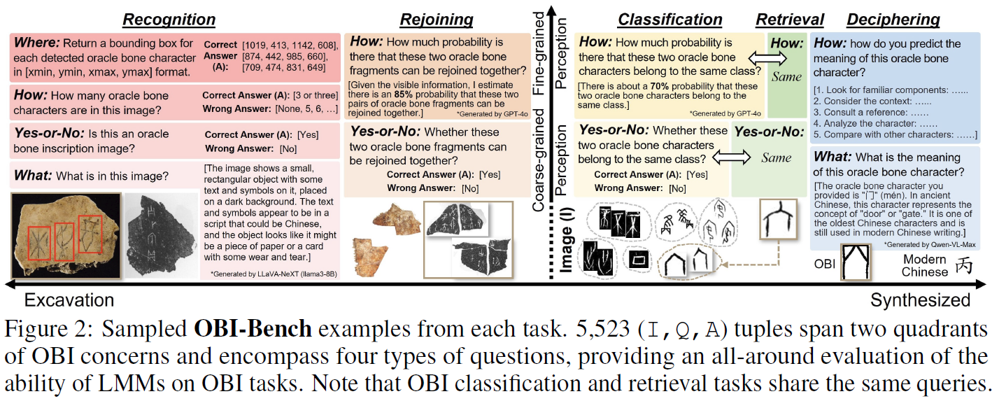
  </div>

## Image Sources
We collect 5,523 OBI images from 11 distinct sources. Due to the lack of publicly
available OBI recognition datasets on real oracle bones and OBI rejoining datasets, we propose the **original oracle bone recognition (O2BR)** dataset and **OBI-rejoin** dataset.
<div style="width: 80%; text-align: center; margin:auto;">
      
  </div>

## Benchmark Candidates
We select **23** up to date and prevailing LMMs for evaluation including **6** proprietary LMMs and **17** open-source LMMs. 
<div style="width: 80%; text-align: center; margin:auto;">
      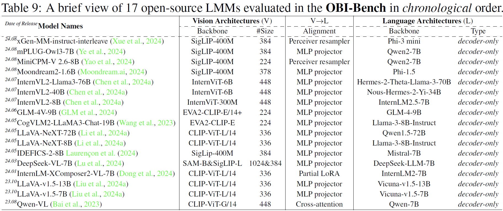
  </div>

## Performance Benchmark on Five OBI Tasks 

<details close>
<summary>Results on the recognition tasks (click to expand)</summary>

<div style="width: 70%; text-align: center; margin:auto;">
      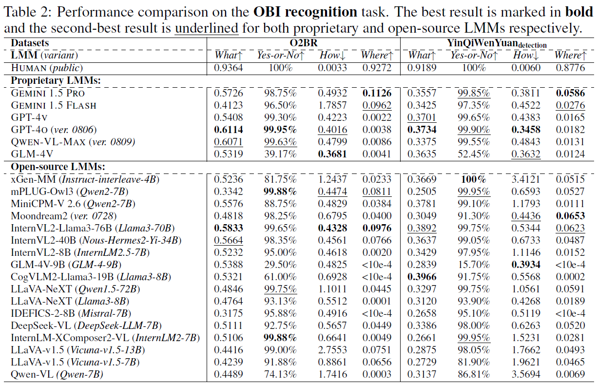
  </div>
</details>

<details close>
<summary>Results on the rejoining tasks (click to expand)</summary>

<div style="width: 70%; text-align: center; margin:auto;">
      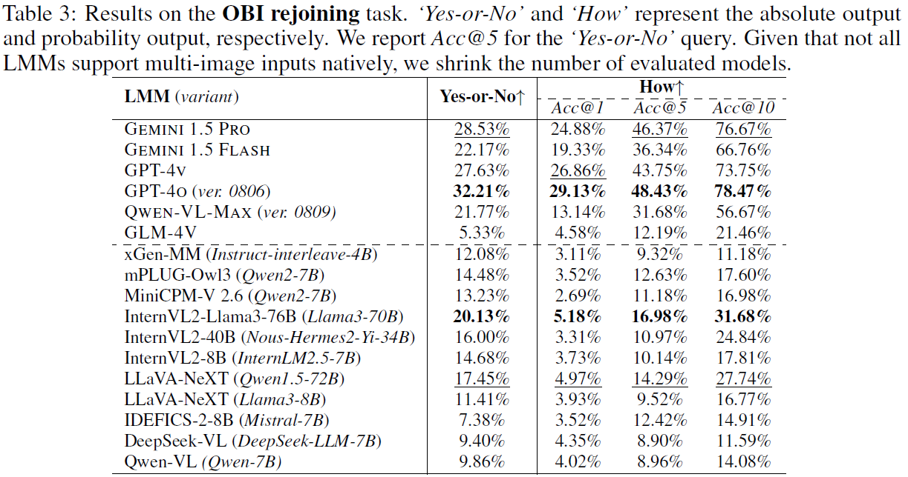
  </div>
</details>

<details close>
<summary>Results on the classification tasks (click to expand)</summary>

<div style="width: 70%; text-align: center; margin:auto;">
      
  </div>

- Effects of the number of character categories on classification accuracy:
<div style="width: 40%; text-align: center; margin:auto;">
      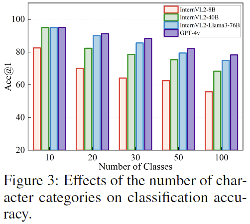
  </div>
</details>

<details close>
<summary>Results on the retrieval tasks (click to expand)</summary>

<div style="width: 70%; text-align: center; margin:auto;">
      
  </div>
</details>

<details close>
<summary>Results on the deciphering tasks (click to expand)</summary>

<div style="width: 70%; text-align: center; margin:auto;">
      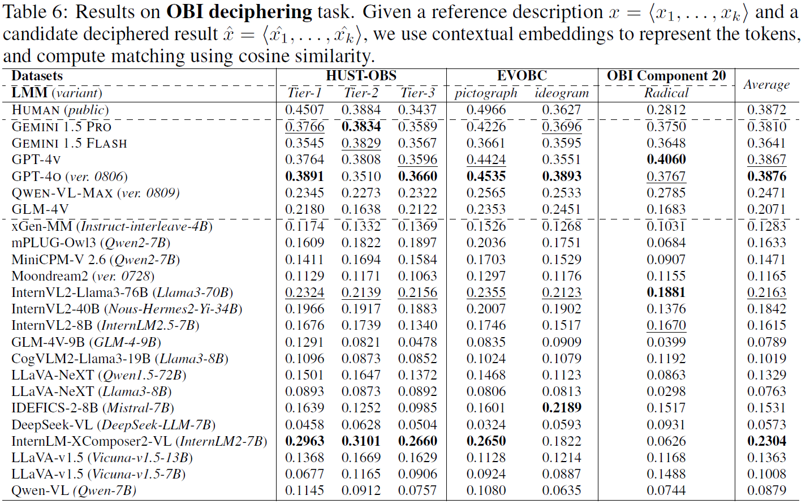
  </div>

- Comparison between GPT-4o and Qwen-VL-Max:
<div style="width: 80%; text-align: center; margin:auto;">
      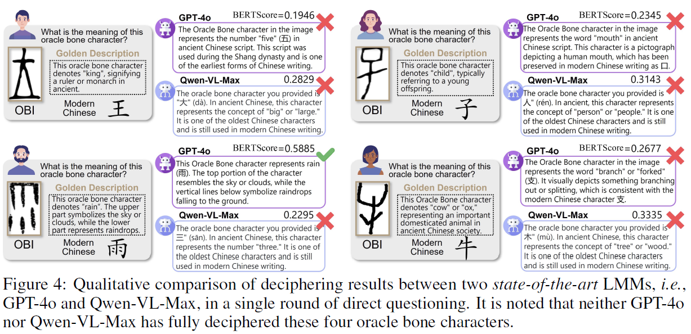
  </div>
</details>

<details close>
<summary>More deciphering results (click to expand)</summary>

<div style="width: 70%; text-align: center; margin:auto;">
      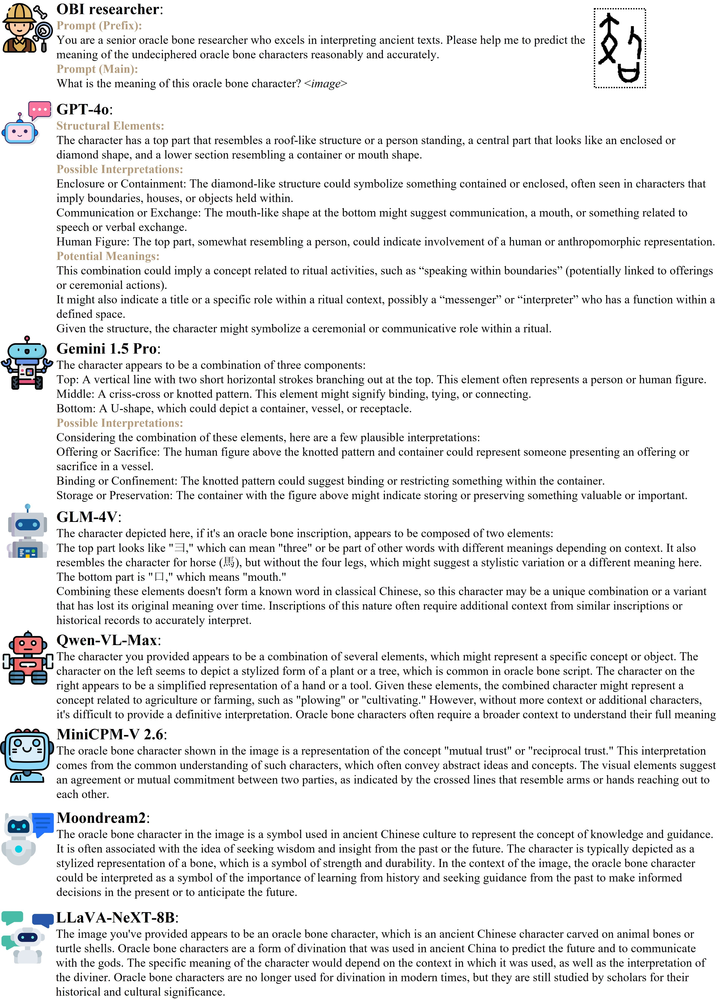
  </div>
  <div style="width: 70%; text-align: center; margin:auto;">
      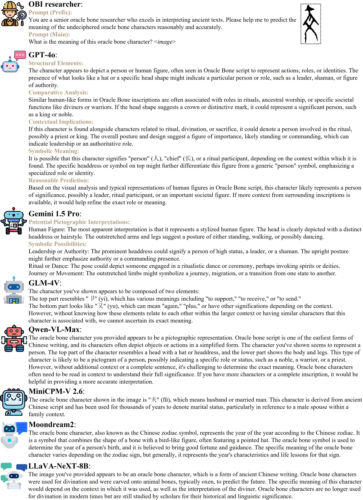
  </div>
  <div style="width: 70%; text-align: center; margin:auto;">
      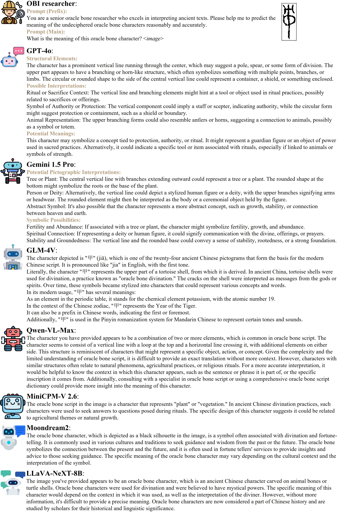
  </div>
  <div style="width: 70%; text-align: center; margin:auto;">
      
  </div>
  <div style="width: 70%; text-align: center; margin:auto;">
      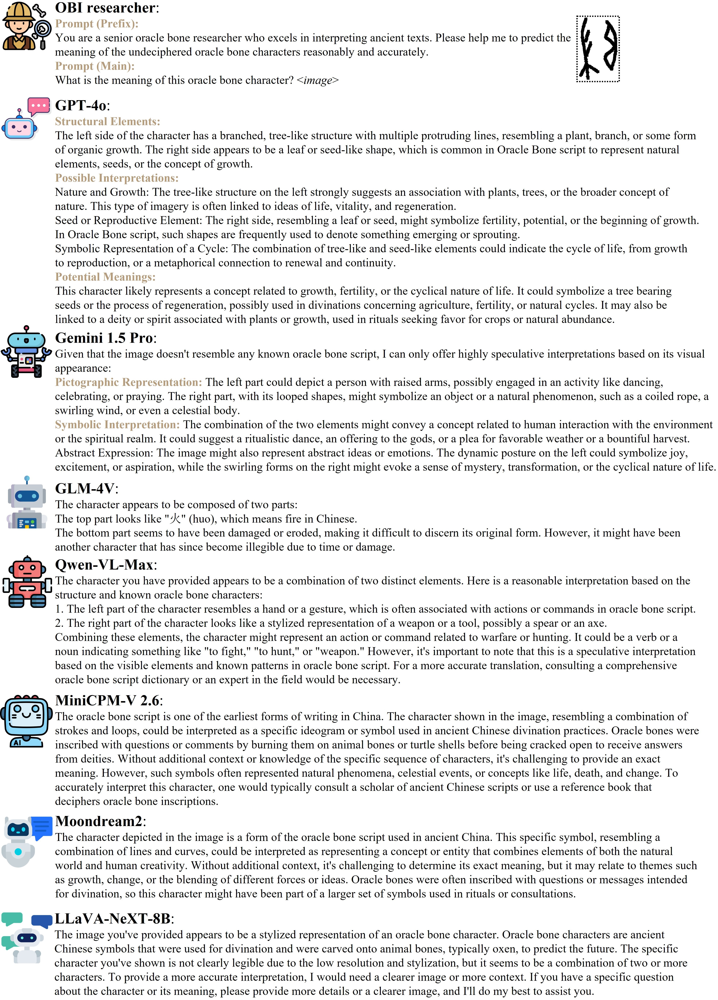
  </div>
</details>

## Original Oracle Bone Recognition (O2BR) Dataset 📦
- [ ] To be released

<div style="width: 80%; text-align: center; margin:auto;">
      
  </div>

## OBI-rejoin Dataset 📦
- [ ] To be released

<div style="width: 80%; text-align: center; margin:auto;">
      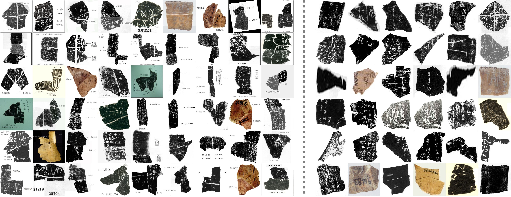
  </div>


## Contact 📧

Please contact the first author of this paper for queries.

- Zijian Chen, `zijian.chen@sjtu.edu.cn`

## Citation📎
If you find our work interesting, please feel free to cite our paper:
```
@article{chen2024obi,
  title={OBI-Bench: Can LMMs Aid in Study of Ancient Script on Oracle Bones?},
  author={Chen, Zijian and Chen, Tingzhu and Zhang, Wenjun and Zhai, Guangtao},
  journal={arXiv preprint arXiv:2412.01175},
  year={2024}
}
```

## <a name="acknowledgements"></a> Acknowledgements💡
We extend our deepest gratitude to the frontline OBI researchers and scholars involved in the meticulous collation and proofreading of the oracle bone inscriptions. It is your persistent manual efforts that have provided a valuable data foundation for the development of artificial intelligence models.
